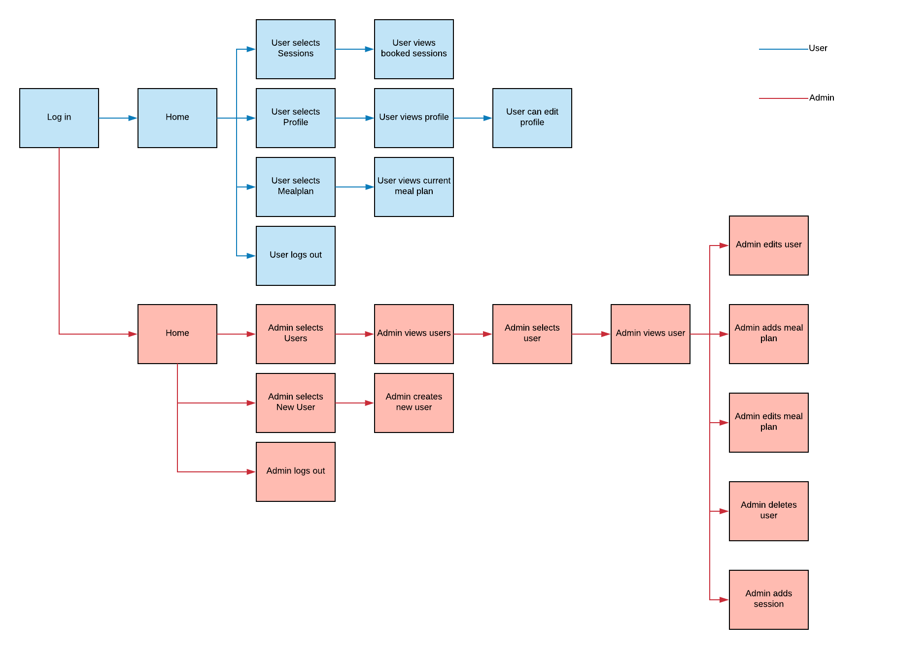
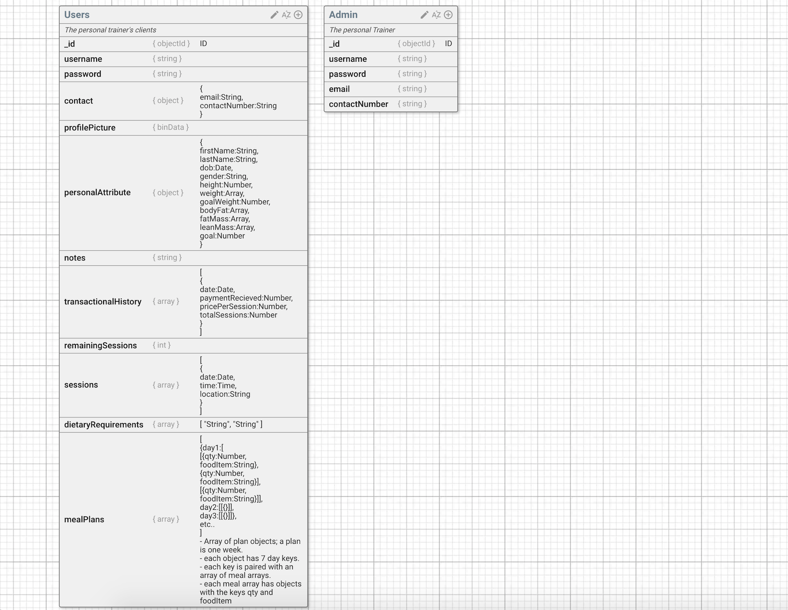
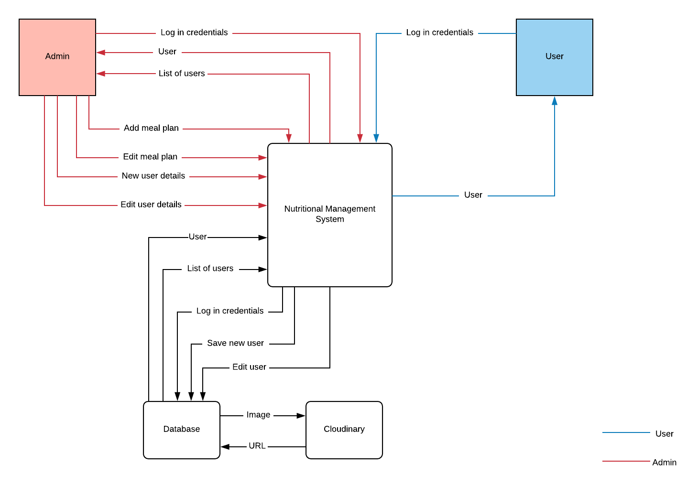

# Skyefit

## Description

## Tech Stack

* React.js
* Express
* Node.js
* Mongo / Mongoose

## Project Management

### Compose a summary of your application including problem definition and solution

### Review the conceptual design with the client and edit based on their feedback

### User stories for the whole application

As admin ISBAT: 
* log in 
* log out
* view all my clients and their details including profile, bookings and meal plans
* generate new users, edit their details and delete a user
* add, edit and delete bookings
* create, edit and delete meal plans for my clients to view on their accounts
* calculate and store data based on the Jackson Pollock skinfold method
* view my dashboard with a calendar which will show upcoming booked sessions
* view nutritional information of desired foods
* filter through my clients

As user ISBAT:
* log in
* log out
* view and edit my profile
* view my personal trainer’s meal plans
* view remaining number of paid/booked sessions
* view my upcoming sessions on a calendar

### A workflow diagram of the user journey/s

### Wireframes for all main pages of your app

### Entity Relationship Diagram (ERD)

### Project plan and effort estimation

### Data Flow Diagram

### OO design documentation

### 2.1.4 Tools & Methodologies

### Demonstrate your project management skills

### Trello

### GitHub

### Use Agile development methodologies

### Code review

### What are the most important aspects of quality software?

* Identifying and solving user stories
* Continual and automated testing is integral to ensure smooth performance
* Ensure design and framework is robust yet flexible for future changes
* Frequent communication with the client and assessing feedback
* Keeping the code DRY, re-use components as much as possible
* Writing comments when appropriate
* Ensure functions are suitable and accurate, and functions handling sensitive data are secure and compliant to relevant guidelines

### What libraries are being used in the app and why?

* Axios: Provided a more convenient and readable syntax when making HTTP requests
* Body Parser: Important for accessing payloads (req.body) from POST, PUT and DELETE requests
* Bcrypt: Package that hashes passwords before being stored in the database for security
* Cloudinary: Permits users to upload images that is stored in the cloud
* Cookie-session: Allows for cookies which are used for authentication
* Cors: Allows the client to communicate with the API without issue
* Dotenv: Essential for storing sensitive data (keys, secrets) in environmental variables
* Express: Framework for the backend
* JSONWEBTOKEN: Authentication with tokens, an added layer of security on top of cookies
* jwt-decode: Allows the ability to decode the token in the front-end
* Moment: A convenient library for manipulating date formats
* Mongoose: Used to generate models which interacts with the database
* Multer: Allows for temporary in-memory storage before uploading to Cloudinary
* Nodemon: Convenient dev package that restarts the server when alterations are made
* Now: We used now.sh to deploy our backend application
* Passport: Important middleware responsible for authenticating username and password

3. A team is about to engage in a project, developing a website for a small business. What knowledge and skills would they need in order to develop the project?

4. Within your own project what knowledge or skills were required to complete your project, and overcome challenges?
Corey: 
Lily:
Simon:
Mat: 

5. Evaluate how effective your knowledge and skills were this project, using examples, and suggest changes or improvements for future projects of a similar nature?
Corey: 
Lily:
Simon:
Mat: 

## Developers:
* Lily
* Simon
* Corey
* Mat Watts